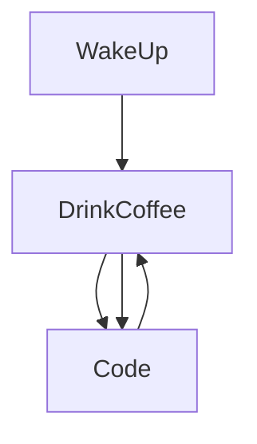
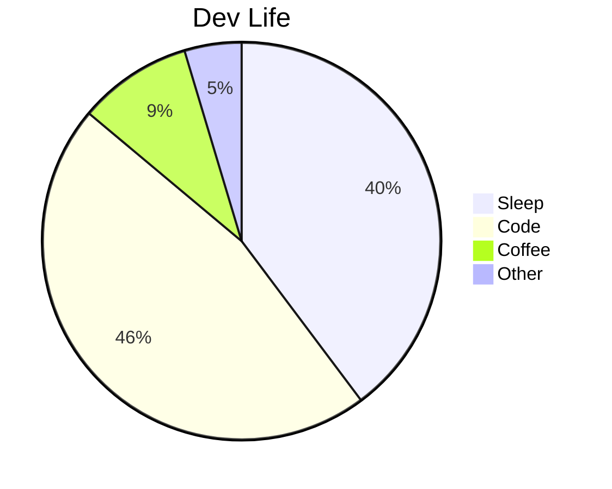

# diagrams
diagrams using markdown

```mermaid
  graph TD;
      WakeUp-->DrinkCoffee;
      DrinkCoffee-->Code;
      Code-->DrinkCoffee;
      DrinkCoffee-->Code;
```

```mermaid
pie
    title Dev Life
    "Sleep" : 42.96
    "Code" : 50.05
    "Coffee" : 10.01
    "Other" :  5
```

